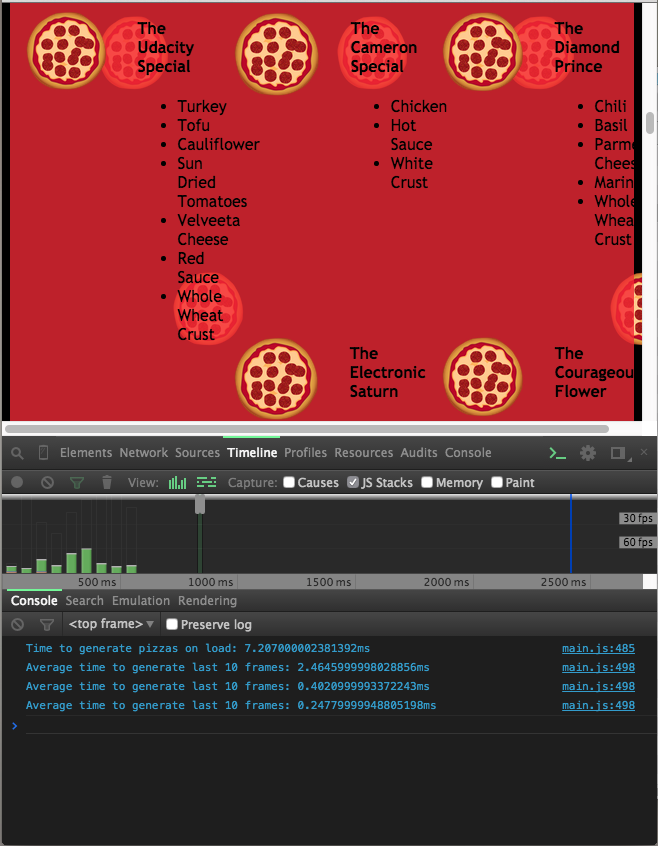

#Project4 - Web Optimization


##Project Objective:

You will optimize a provided website with a number of optimization- and performance-related issues so that it achieves a target PageSpeed score and runs at 60 frames per second.


##Approaches to Optimization Web Performance:
*index.html
** Using inline CSS to avoid default CSS rendering blocking
** Minify style.css file, utilize media query to 'print.css' to a*void needless download
** Minify JavaScript file, moving the script section to bottom of HTML
*main.js
** First stage optimization: move the below code outside the for loop
```
var elem = document.createElement('img')
```
** Second Stage Optimization: reducing the scripting time by using `document.getElementByClassName()` instead of `document.querySelectorAll()`, which is the slowest way to access DOM; reducing layout time by `transform: translateX()`

* Third Stage Optimization: reducing painting time by adding the following code to`views\css\style.css`
```
.randomPizzaContainer {
  float: left;
  display: flex;
  backface-visibility: hidden
  transform: translateZ(0);
  transform: translate3d(0,0,0);

}
```

##Result:



